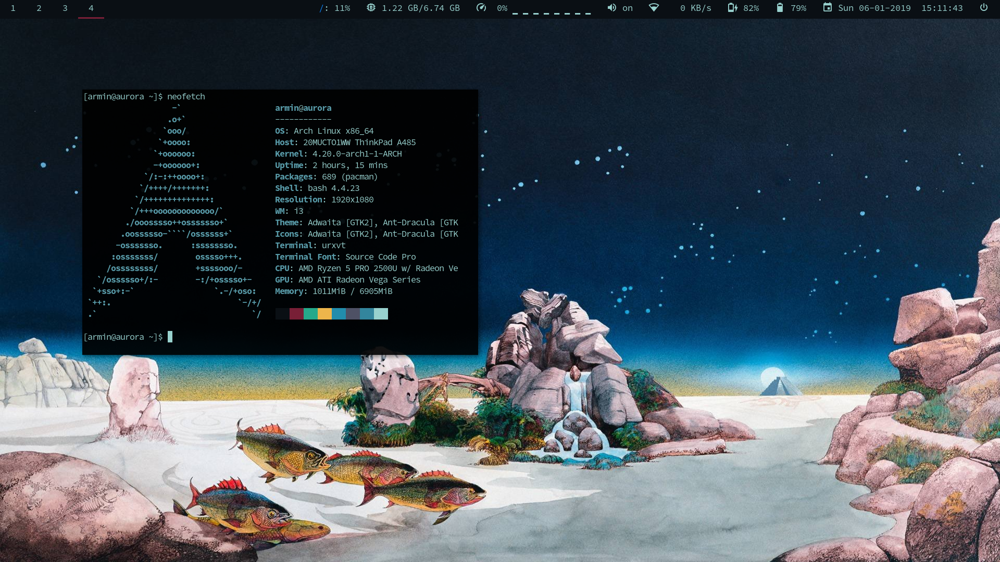
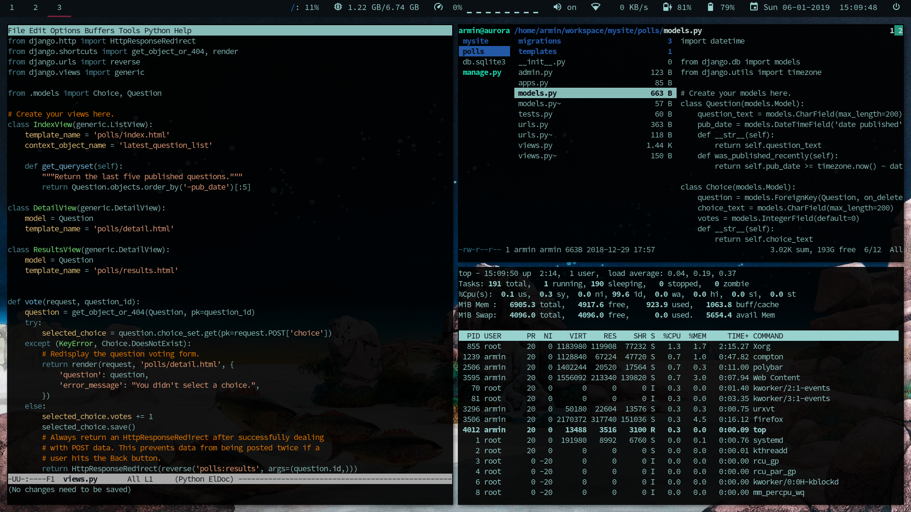
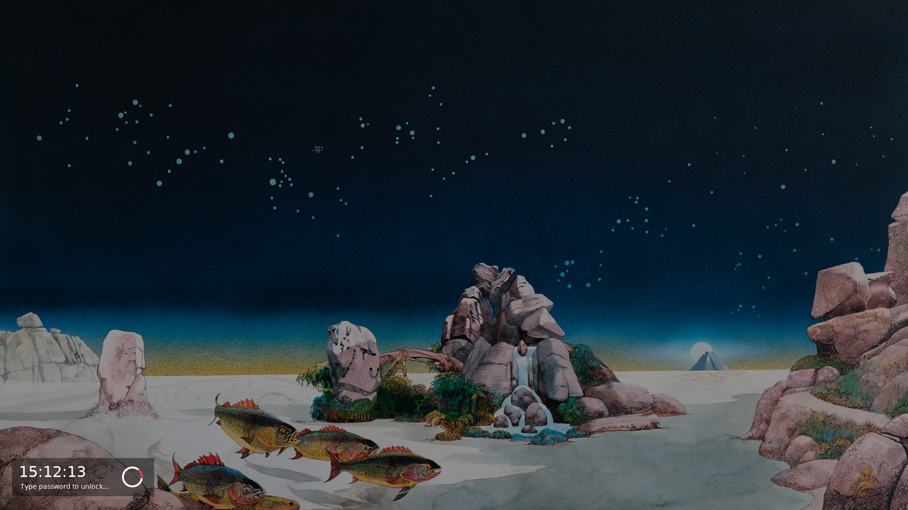

# dotfiles

## software

* [i3-gaps](https://github.com/Airblader/i3)
* [urxvt](http://software.schmorp.de/pkg/rxvt-unicode.html)
* [polybar](https://github.com/jaagr/polybar)
* [compton](https://github.com/chjj/compton)
* [rofi](https://github.com/DaveDavenport/rofi)
* [betterlockscreen](https://github.com/pavanjadhaw/betterlockscreen)
* [dunst](https://github.com/dunst-project/dunst)
* [neofetch](https://github.com/dylanaraps/neofetch)

## fonts

* [Adobe Source Code Pro](https://github.com/adobe-fonts/source-code-pro) 
  for wm,bar,urxvt
* [Material Design Icons](https://materialdesignicons.com) 
  for polybar icons

## gtk-3 theme

* [Ant-Dracula](https://github.com/EliverLara/Ant-Dracula)

## wallpaper

https://wallpapercave.com/w/5rOSR2z

## screenshots

screenshots of the current configuration

 

